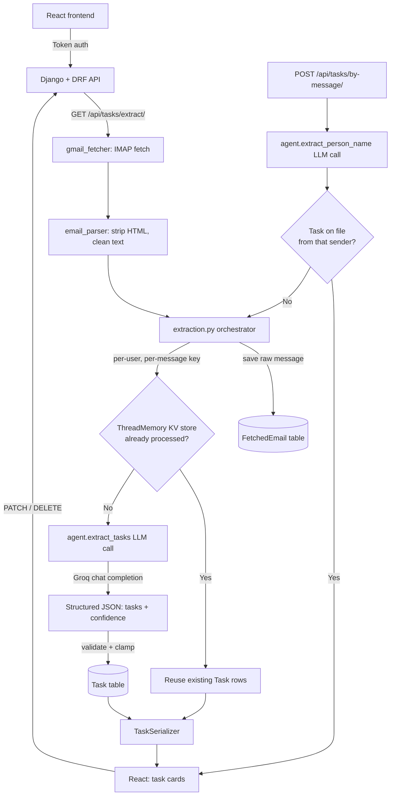

# Email-to-Task Agent

An agent that scans a Gmail inbox, extracts action items from emails with an
LLM, and turns them into a de-duplicated, editable task list — surfaced
through a Django REST API and a React dashboard.

This README documents what is actually implemented in this repo. For the
full HTTP API contract, see [`openapi.yaml`](./openapi.yaml).

---

## Table of contents

- [Architecture](#architecture)
- [Repository layout](#repository-layout)
- [Tech stack](#tech-stack)
- [AI feature design](#ai-feature-design)
- [Setup guide](#setup-guide)
- [Running the project](#running-the-project)
- [API summary](#api-summary)
- [Testing](#testing)
- [Known limitations / design trade-offs](#known-limitations--design-trade-offs)

---

## Architecture



**Flow summary:** the frontend authenticates with a DRF token, then calls
`GET /api/tasks/extract/`. That view fetches recent mail over IMAP, cleans
each body to plain text, and checks a per-user/per-message key against the
`ThreadMemory` KV table to avoid re-processing anything already seen. New
messages go to the Agent package, which calls an LLM (Groq) and returns
structured JSON tasks with a confidence score; the backend validates and
persists them. The frontend renders tasks as editable cards and can PATCH
or DELETE them directly. A separate endpoint, `/api/tasks/by-message/`,
lets a user ask "what did X ask me to do?" in free text — the Agent
extracts the name, and the backend checks the DB first, falling back to a
live, sender-scoped IMAP fetch only on a miss.

## Repository layout

```
.
├── manage.py                  # Django entrypoint
├── pyproject.toml             # uv workspace root (Django project + deps)
├── pytest.ini                 # DJANGO_SETTINGS_MODULE + test discovery
├── Conftest.py                # makes Agent/src importable for pytest
│
├── BackEnd/                   # Django project
│   ├── settings.py            # DB, DRF auth, CORS, Gmail env vars
│   ├── urls.py                # /admin/, /api/tasks/, /api-token-auth/
│   ├── asgi.py / wsgi.py
│   ├── tasks/                 # Task app
│   │   ├── models.py          # Task, ThreadMemory
│   │   ├── serializers.py     # TaskSerializer
│   │   ├── views.py           # list/detail/extract/by-message views
│   │   ├── urls.py
│   │   ├── admin.py
│   │   └── services/
│   │       ├── extraction.py  # email -> task orchestration
│   │       ├── kv_store.py    # get/set/exists/delete over ThreadMemory
│   │       └── name_lookup.py # name extraction -> DB/live lookup
│   └── emails/                # Email ingestion app
│       ├── models.py          # FetchedEmail
│       ├── gmail_fetcher.py   # IMAP client
│       ├── email_parser.py    # MIME -> plain text (no network calls)
│       └── admin.py
│
├── Agent/                     # Standalone `agent` package (uv workspace member)
│   └── src/agent/
│       ├── extract_tasks.py   # public entrypoint: extract_tasks(text)
│       ├── name_extraction.py # public entrypoint: extract_person_name(text)
│       ├── agent_runner.py    # prompt + JSON parsing + tool dispatch
│       ├── model_client.py    # ModelClient ABC + GroqModelClient
│       ├── tool_registry.py   # name -> handler registry
│       └── schemas.py         # ExtractedTask TypedDict
│
└── frontend/ (Vite + React)
    ├── src/
    │   ├── App.jsx / main.jsx
    │   ├── api/tasksApi.js    # fetch wrapper, token storage, all API calls
    │   ├── pages/             # LoginPage, HomePage
    │   └── components/        # ScanBar, TaskList, TaskCard, NameFinderBar, ...
    └── package.json
```

## Tech stack

| Component | Description |
|---|---|
| **Backend** — Django 4.2 + DRF | API, token auth, task/email database |
| **Frontend** — React 19 + Vite | Dashboard for scanning, reviewing, and editing tasks |
| **Agent package** (`Agent/`) | Standalone Python package, workspace-managed via `uv`; the *only* thing Backend imports from it is `extract_tasks()` and `extract_person_name()` |
| **LLM provider** — Groq (`openai/gpt-oss-120b`) | Powers both task extraction and name extraction, with retry/backoff on transient failures |
| **Database** — SQLite | `Task`, `ThreadMemory`, `FetchedEmail` tables (via Django ORM) |
| **Email source** — Gmail via IMAP (`imaplib`) | Fetches raw messages; `python-dotenv` loads credentials from `.env` |
| **Auth** — DRF Token Authentication | Chosen over session/cookie auth because the frontend is a cross-origin SPA — avoids CSRF plumbing for a decoupled client |
| **pytest** + `pytest-django` | Backend/agent test suite |
| **ESLint** | Frontend linting |

## AI feature design

### Two entrypoints, one contract

The Agent package exposes exactly two functions to the rest of the system,
both plain Python in, plain Python out — no knowledge of Gmail, Django, or
HTTP on either side of the boundary:

- `extract_tasks(text: str) -> list[ExtractedTask]`
- `extract_person_name(message: str) -> str | None`

`BackEnd/tasks/services/extraction.py` and `.../name_lookup.py` are the
only callers. This keeps the Agent independently testable and swappable.

### Prompting and output parsing

Both entrypoints use the same pattern:

1. A system prompt instructs the model to return **only** JSON matching a
   fixed schema (no markdown, no explanation).
2. `_parse_tasks_json` / `_parse_name_json` first attempt `json.loads` on
   the raw response; if that fails, they strip a possible ` ```json ` code
   fence, then fall back to slicing between the first `{` and last `}`.
   Anything still unparseable degrades to an empty result rather than
   raising — a single malformed LLM response never crashes a scan.
3. Every field from the model is validated before it touches the
   database: `confidence` is coerced to `float` and clamped to `[0, 1]`;
   `priority` is only accepted if it's exactly `low`/`medium`/`high`
   (Django's `choices=` does **not** enforce this on `.objects.create()`
   without `full_clean()`, so this check is what actually stops a
   hallucinated priority string from being saved); `due_date` is parsed
   as `YYYY-MM-DD` and silently becomes `None` on anything else.

### Model provider

`model_client.py` defines a `ModelClient` ABC so the LLM backend is
swappable; `GroqModelClient` is the current (and only) implementation,
calling `openai/gpt-oss-120b` at `temperature=0.2` with up to 3 retries on
any exception (network blips, rate limits) using linear backoff.

### Memory / dedupe layer

`ThreadMemory` (a generic key-value table) is the Agent's persistence
layer for "have I already handled this email?" The key is deliberately
**`{user_id}:{message_id}`** — per user, per individual message — and
*not* per email thread:

> Keying by thread would mean one processed message marks the whole
> thread as done, so a genuinely new reply in that thread gets skipped
> and its tasks are never created.

On a cache hit, the previously-created `Task` rows are reused and the LLM
is not called again for that message. This is the current dedupe
mechanism end-to-end — there is no vector-similarity layer in this repo
at present (see [Known limitations](#known-limitations--design-trade-offs)).

### Two-step name lookup

`/api/tasks/by-message/` answers free-text questions like *"what did
Sarah ask me to do?"* in two stages, LLM only where genuinely needed:

1. **LLM (ambiguous step):** `extract_person_name()` pulls a name out of
   an arbitrary sentence.
2. **Plain DB filter (unambiguous step):** once a name is known, look up
   the most recent `Task` with a matching `sender`, scoped to
   `request.user`. No LLM or Gmail call needed for this part — most
   searches resolve here.
3. **Live fallback:** only on a miss does it trigger a sender-scoped IMAP
   fetch (`limit=1`) through the same `run_extraction()` pipeline used by
   "Scan Inbox," so a person who just emailed can still be found without
   a manual re-scan.

### Ownership and isolation

Every `Task` row is created with `owner=user`, where `user` is always
`request.user` from the authenticated view — never client-supplied data.
`TaskListView`/`TaskDetailView` filter their querysets by `owner`, so a
request for another user's task ID returns a plain 404 (not 403),
meaning its existence is never revealed to a user who doesn't own it.

## Setup guide

### Prerequisites

- Python ≥ 3.12
- [`uv`](https://docs.astral.sh/uv/) (this repo is a uv workspace —
  `BackEnd`/root project + `Agent` member)
- Node.js (for the React frontend)
- A Gmail account with an **App Password** (IMAP access, 2FA required)
- A [Groq API key](https://console.groq.com/)

### 1. Clone and install Python dependencies

```bash
uv sync
```

This installs the root project (`email-task-agent`, from `pyproject.toml`)
and resolves the `Agent` workspace member as an editable dependency.

### 2. Environment variables

Two separate `.env` files are read by this project:

**`.env`** at the repo root (next to `manage.py`), loaded by
`BackEnd/settings.py`:

```env
GMAIL_USER=you@gmail.com
GMAIL_APP_PASSWORD=xxxx xxxx xxxx xxxx
TASK_SENDER_FILTER=                # optional; blank = scan all senders
```

**`Config/.env`**, one level above `Agent/` (loaded by
`Agent/src/agent/extract_tasks.py` via a hardcoded relative path —
`Agent/src/agent/../../../Config/.env`):

```env
GROQ_API=your_groq_api_key_here
```

> Neither file should ever be committed. If a Gmail App Password was ever
> checked into version control, rotate it before reusing it.

### 3. Django setup

```bash
uv run python manage.py migrate
uv run python manage.py createsuperuser   # or create a user via /admin/
```

A user needs to exist (and you need a token for it) before the frontend
can authenticate — see [Running the project](#running-the-project).

### 4. Frontend setup

```bash
cd frontend        # or wherever package.json lives
npm install
```

Optionally set the API base URL if it differs from the default
(`http://127.0.0.1:8000`):

```env
# frontend/.env
VITE_API_BASE_URL=http://127.0.0.1:8000
```

## Running the project

**Backend:**

```bash
uv run python manage.py runserver
```

**Frontend** (in a separate terminal):

```bash
cd frontend
npm run dev
```

The Vite dev server defaults to `http://localhost:5173`, which is already
allow-listed in `CORS_ALLOWED_ORIGINS` in `settings.py`.

**Logging in:** the frontend calls `POST /api-token-auth/` with a Django
username/password and stores the returned token in `sessionStorage`. Every
subsequent request sends `Authorization: Token <token>`.

## API summary

Full request/response schemas are in [`openapi.yaml`](./openapi.yaml).
At a glance:

| Method | Path | Purpose |
|---|---|---|
| `POST` | `/api-token-auth/` | Exchange username/password for an auth token |
| `GET` | `/api/tasks/` | List the authenticated user's tasks |
| `GET` / `PATCH` / `PUT` / `DELETE` | `/api/tasks/{id}/` | Read, edit, or remove a single task |
| `GET` | `/api/tasks/extract/?limit=10` | Scan the inbox and extract new tasks |
| `POST` | `/api/tasks/by-message/` | Free-text "what did X ask me to do?" lookup |

All endpoints except `/api-token-auth/` require the token header and are
scoped to the calling user (`IsAuthenticated` is the DRF default for every
view in this project — nothing is open unless it explicitly opts out).

## Testing

```bash
uv run pytest
```

`pytest.ini` points Django at `BackEnd.settings`; `Conftest.py` adds
`Agent/src` to `sys.path` so `import agent` resolves the same way it does
via the uv workspace in production code.

## Known limitations / design trade-offs

- **Single LLM provider.** Only Groq is wired up (`GroqModelClient`).
  There is no local-model triage step, no second provider, and no
  MCP server in this codebase — an earlier design draft called for
  those, but they aren't implemented here.
- **No vector-similarity dedupe.** Deduplication is exact-match only,
  keyed on `(user_id, message_id)` via `ThreadMemory`. Two emails about
  the same request that don't share a `Message-ID`/thread will be
  extracted as separate tasks.
- **IMAP, not the Gmail API.** `gmail_fetcher.py` uses `imaplib` with an
  App Password, not OAuth2 + the Gmail REST API — simpler to set up, but
  means no incremental/webhook-based sync; every scan re-walks the
  inbox up to `limit`.
- **`sender` isn't in the general Task API.** The `Task` model stores the
  source email's `From` header, but `TaskSerializer` doesn't expose it —
  only the `/api/tasks/by-message/` response includes `sender`, since
  that's the field `name_lookup.py` filters on.
- **Extraction failures degrade silently.** If the LLM call in
  `extraction.py` raises, the exception is caught, logged to stdout, and
  that message simply produces zero tasks rather than failing the whole
  scan — appropriate for a background-ish batch operation, but it means
  a failure isn't surfaced to the frontend beyond an empty result for
  that message.